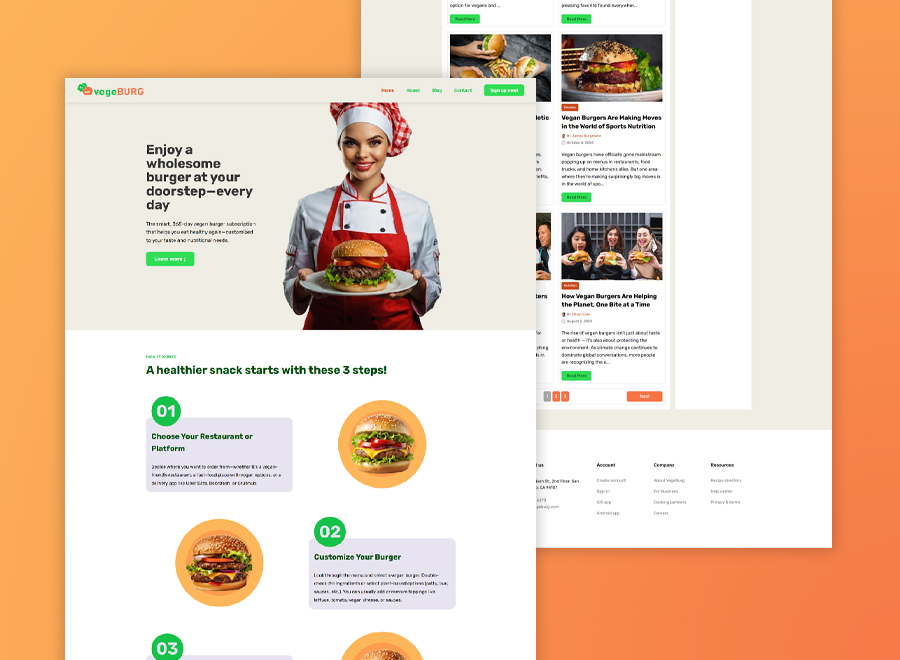

# VegeBurg - A Modern Vegetarian & Vegan Restaurant Web Template

**VegeBurg** is a sleek and responsive web template designed specifically for vegetarian and vegan restaurants, health food cafes, or any establishment promoting a plant-based lifestyle. Built with **React** for dynamic user interfaces and styled with **Sass** for efficient and organized CSS. This was one of those templates I did for a client at Upwork.



### Technologies

   

### Tools

  

## Key Areas

- **Home** Most of the content came from my data/data.js then the **Testimonial** section was the challenging part. I made the images clickable then an **Image Modal** will handle the previous and next view of the image.

- **Blog** This is the most challenging part of this project, I enjoyed doing research about useSearchParams, useRef, useContext and many more.

## Features

- **Responsive Design:** Optimized for seamless viewing across all devices, from desktops to mobile phones.
- **Sass Styling:** Leverages the power of Sass for maintainable, scalable, and beautifully crafted styles.
- **Modern Aesthetics:** Clean, vibrant, and inviting design to appeal to health-conscious customers.
- **Intuitive Navigation:** User-friendly navigation to ensure a smooth Browse experience.

### Installation

1.  Clone the repository:
    ```bash
    git clone [https://github.com/](https://github.com/)[YourUsername]/VegeBurg.git
    ```
2.  Navigate into the project directory:
    ```bash
    cd VegeBurg
    ```
3.  Install the dependencies:
    ```bash
    npm install
    ```

### Running the Project

To start the development server:

```bash
npm run dev
```
